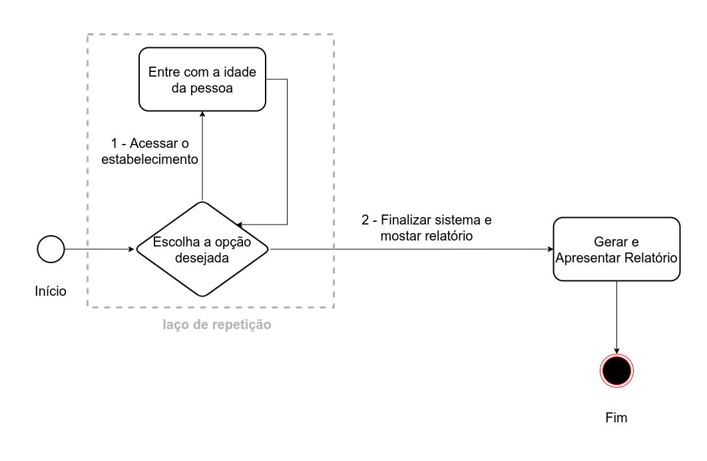

# Access-Control-System

## Challenge Requirements

## Challenge Description: Access Control System

Congratulations! 👏 You have received a demand to develop an intelligent access control system for a facility. It has been agreed with the client that the system, when completed, must present a report that divides the people who accessed the facility into three categories:

People under 18 years old,
Adults (between 18 and 49 years old), and
People 50 years old and over.

With this report, the client can make decisions based on information to reach or retain its clientele. This system should present a menu, in the console, indicating the option to access the facility and the option to finish the system and show a report. The system flow is defined following two main steps that must be executed in the following order:

1. **Insert the age of the client into the system:** this step is repeated until the option to finish the system is chosen. The age of the client people must be stored in a dynamically sized array, as we do not know how many client people will arrive at the facility. Tip: use the ArrayList class from Java for the creation and manipulation of dynamically sized arrays. For more information, you can consult the website of W3Schools or JavaPoint, or check the Oracle documentation.

2. **Finish the system and show the report:** in this step, the loop must be terminated, and then the report must be printed on the console. The report should contain the total number of people who accessed the facility, as well as the number of people under 18, the number of adults (between 18 and 49), and the number of people 50 and over who accessed the facility. The report should also calculate, in relation to the total number of people, the percentage of people who were under 18, who were adults (between 18 and 49), and those who were 50 and over.

The image below shows the flow that the program should follow:



This system should have the Principal class containing the main method. In the main method, an instance of the Scanner class is required to read user inputs through the console, and a loop that represents the application menu. This way we can register the entry of all people who arrive during the workday.

The menu should have the format:

    ```
    Enter the number corresponding to the desired option:
    1 - Access the establishment
    2 - Finish the system and show the report

    ```
If the user enters the value 1 (which indicates that they want to access the establishment), then the message Enter the age: will be printed to the console. Then, after inserting the client's age and pressing enter, one of the messages listed below will appear:

- `Underage client, turnstile released!`: if the inserted age is less than 18 years old.

- `Adult client, turnstile released!`: if the inserted age is equal or greater than 18 years old, and less or equal to 49 years old.

- `Adult client from 50 years old, turnstile released!`: if the inserted age is 50 years old or more.

After the message is printed, it should return to the initial state of the menu. Assuming that the age of the first person is 18 years old, an example of the console content after inserting the age of the first client will be:
```
Enter the number corresponding to the desired option:
1 - Access the establishment
2 - Finish the system and show report
1
Enter your age:
18
Adult person, turnstile released!
Enter the number corresponding to the desired option:
1 - Access the establishment
2 - Finish the system and show report
```

This cycle repeats until option 2 is chosen, indicating that the user wants to end business hours and print the report.

⚠️🔴**TIP: use a short type variable to store the option entered by the user, as it is a small-scale numerical value.** 🔴⚠️

After implementing the menu part, you must implement the final part, which is the report. As mentioned earlier, the report is a fundamental part of the system because it provides information for the establishment owner to develop strategies to increase their clientele and, consequently, increase their profit, generating more jobs and impacting the lives of many people. Can you see the importance of a well-developed system?

The report should be printed to the console when option 2 is selected. Assuming that 200 people visited the establishment, the report should contain the following information:

- Total number of people who visited the establishment: in this case, this value should be 200.

- Number of people under 18 who visited the establishment: assuming that out of the 200 people, 20 were under 18 years old, then this value should be 20 in the report.

- Number of adult people (between 18 and 49 years old) who visited the establishment: assuming that out of the 200 people, 150 were adults between 18 and 49 years old, then this value should be 150.

- Number of people 50 years old or older who visited the establishment: assuming that out of the 200 people, 30 were 50 years old or older, then this value should be 30.


The report should also calculate the percentage of people in each category relative to the total number of people. Still following the previous assumption, the total number of visits to the establishment was 6 people, so the report in the percentage section should show:

- Percentage of people under 18 who visited the establishment: assuming that out of 6 people, 2 were under 18, then this value should be 33.3% in the report.

- Number of adult people (between 18 and 49 years old) who visited the establishment: assuming that out of 6 people, 2 were adults between 18 and 49 years old, then this value should be 33.3% in the report.

- Number of people aged 50 and over who visited the establishment: assuming that out of 6 people, 2 were aged 50 and over, then this value should be 33.3% in the report.

For this assumption, the report output should be similar to the output below:
```
----- Quantidade -----
menores: 2
adults: 2
a partir de 50: 2

----- Percentual -----
menores: 33.3%
adults: 33.3%
a partir de 50: 33.3%

TOTAL: 6
```

## Constraints

- If the option entered by the user is a value other than 1 or 2, the message Enter a valid option! should be printed to the console, and the menu should return to its initial state.

⚠️🔴**TIP: to format the value of a float or double to have only two decimal places, research about the DecimalFormat class.** 🔴⚠️

Great job! Remember to positively surprise your customer!
